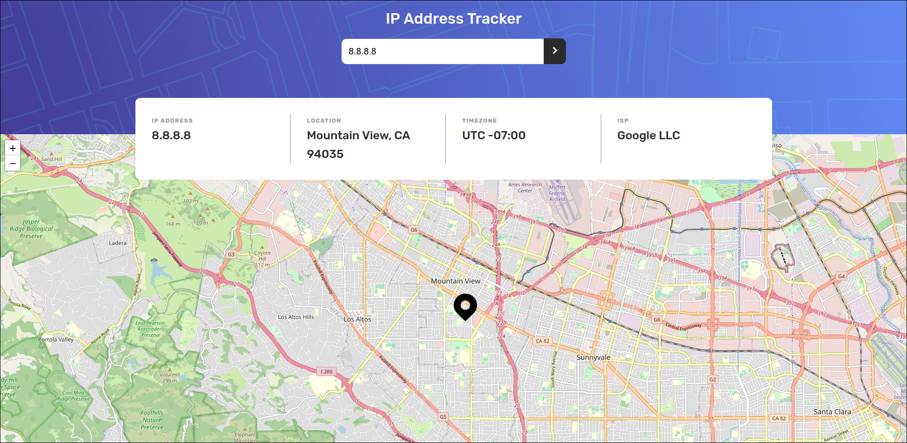

# Frontend Mentor - IP Address Tracker

This is a solution to the [IP Address Tracker App challenge on Frontend Mentor](https://www.frontendmentor.io/challenges/ip-address-tracker-I8-0yYAH0).

## Preview

## Links

- Solution URL: [Solution URL](https://www.frontendmentor.io/solutions/vue-practice-fUHfNygQCH)
- Live Site URL: [Live Solution](https://ip-address-tracker-teal-alpha.vercel.app/)

## Built with

- Vue
- HTML
- CSS

## Author

- Website - [Jesus Venegas](https://www.jesusvenegas.com) (WIP)
- Frontend Mentor - [@kasdeya](https://www.frontendmentor.io/profile/kasdeya)

## Acknowledgments

- Inspiration by [Front End Mentor](https://www.frontendmentor.io/)
